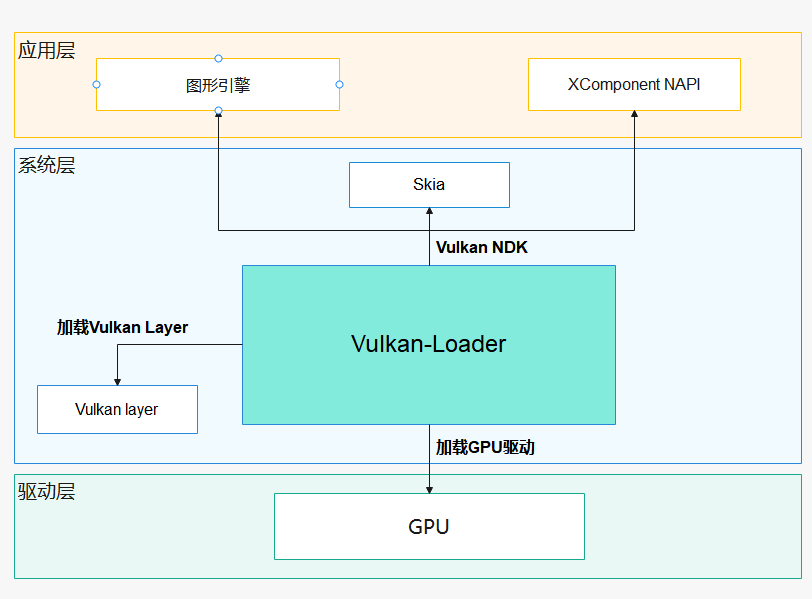

# Vulkan-Loader

本仓库包含开源软件Vulkan-Loader，为OpenHarmony提供对Vulkan的支持能力。

Vulkan是一个跨平台的2D和3D绘图应用程序接口（API）。它的API分为核心API、窗口系统集成(WSI)扩展API以及其他扩展API。

核心API由GPU驱动实现，窗口系统集成(WSI)扩展API由[swapchain_layer](#swapchain_layer)实现，swapchain_layer是OpenHarmony平台是实现的一个Vulkan Layer，安装在`/system/lib[64]/libvulkan_swapchain.so`中。Vulkan Layer属于增强Vulkan开发环境的扩展功能，被实现为动态链接库(.so文件)。

Vulkan-Loader会加载这些API的实现并对外提供这些接口给应用开发者使用。Vulkan-Loader安装在`/system/lib[64]/libvulkan.so`中。

Vulkan-Loader主要功能概括如下:

1、加载GPU驱动。

2、加载Vulkan Layer。

3、提供Vulkan NDK接口。




## 加载GPU驱动

在OpenHarmony上，Vulkan-Loader会扫描指定路径下的GPU驱动的**json清单文件**并读取该文件加载GPU驱动。

### 指定的扫描路径

```
/vendor/etc/vulkan/icd.d/
/system/etc/vulkan/icd.d/
/data/vulkan/icd.d/
```
建议：GPU驱动的json清单文件应放在`/vendor/etc/vulkan/icd.d/`目录中。

Vulkan-Loader会根据GPU驱动的**json清单文件**中配置的`library_path`找到GPU驱动的动态链接库文件(.so文件)并加载。

### GPU驱动的json清单文件示例

```json
{
   "file_format_version": "1.0.1",
   "ICD": {
      "library_path": "path to driver library",
      "api_version": "1.2.205",
      "library_arch" : "64",
      "is_portability_driver": false
   }
}
```

详细介绍请见：[Driver Manifest File Format](docs/LoaderDriverInterface.md#driver-manifest-file-format)

### GPU驱动的实现

GPU驱动需要实现的Vulkan接口请参考文档：[LoaderDriverInterface](docs/LoaderDriverInterface.md)，开发者需要按照文档里的要求实现对应的接口才能够被Vulkan-Loader正确加载。


## 加载Vulkan Layer

Vulkan Layer属于增强Vulkan开发环境的扩展功能，可以由开发人员启用或关闭。启用和关闭Vulkan Layer的方式有很多，可以通过环境变量、配置文件、或者代码来开启和关闭指定的Layer。

在OpenHarmony上，Vulkan-Loader通过读取指定路径下的Layer的**json清单文件**加载Vulkan Layer。

### 指定的扫描路径

```
/system/etc/vulkan/implicit_layer.d/
/system/etc/vulkan/explicit_layer.d/
/data/vulkan/implicit_layer.d/
/data/vulkan/explicit_layer.d/
```

默认加载的layer的json文件应放在`xxx/implicit_layer.d/`下。
需要显式加载的layer的json文件应放在`xxx/explicit_layer.d/`下，不会被Vulkan-Loader默认加载。

### Vulkan Layer的json清单文件示例

下面给出[swapchain_layer](#swapchain_layer)的json清单文件示例：

```json
{
    "file_format_version" : "1.0.0",
    "layer" : {
        "name": "VK_LAYER_OHOS_surface",
        "type": "GLOBAL",
        "library_path": "libvulkan_swapchain.so",
        "api_version": "1.3.231",
        "implementation_version": "1",
        "description": "Vulkan Swapchain",
        "disable_environment": {
            "DISABLE_OHOS_SWAPCHAIN_LAYER": "1"
        },
        "instance_extensions": [
            { "name": "VK_KHR_surface", "spec_version": "25" },
            { "name": "VK_OHOS_surface", "spec_version": "1" }
        ],
        "device_extensions": [
            { "name": "VK_KHR_swapchain", "spec_version": "70" }
        ]
    }
}
```

详细介绍请见：[Layer Manifest File Format](docs/LoaderLayerInterface.md#layer-manifest-file-format)

### Vulkan Layer的实现

Vulkan Layer需要实现的Vulkan接口请参考文档：[LoaderLayerInterface](docs/LoaderLayerInterface.md)，开发者需要按照文档里的要求实现对应的接口才能够被Vulkan-Loader正确加载。

### swapchain_layer

swapchain_layer是实现Vulkan-Loader与OpenHarmony平台本地窗口(OHNativeWindow)对接的模块，作为一个隐式加载的Vulkan Layer使用。

代码地址：[swapchain_layer](https://gitee.com/openharmony/graphic_graphic_2d/tree/master/frameworks/vulkan_layers/swapchain_layer)


## Vulkan NDK

在OpenHarmony上，Vulkan-Loader会提供Vulkan NDK接口，应用层软件(如：图形引擎、XComponent NAPI等)和系统层图形绘制模块(如：Skia)可以调用这些NDK接口。


## 构建指导

适配OpenHarmony平台的编译脚本请见：[openharmony/BUILD.gn](openharmony/BUILD.gn)

由于graphic_2d模块的编译脚本中包含了Vulkan-Loader（详见：[bundle.json](https://gitee.com/openharmony/graphic_graphic_2d/blob/master/bundle.json)），所以编译graphic_2d模块可以将Vulkan-Loader同时编译出来，以rk3568平台为例，编译命令：

```shell
./build.sh --product-name rk3568 --ccache --build-target graphic_2d
```

也可以单独编译Vulkan-Loader：

```shell
./build.sh --product-name rk3568 --ccache --build-target vulkan_loader
```

编译完成后会在`out/rk3568/graphic/graphic_2d`目录下生成`libvulkan.so`


## License

Apache License 2.0

见 [LICENSE](LICENSE.txt).